# Preface & Introduction

 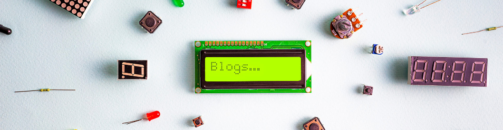

## 1. Introduction

Keyes RFID Starter Kit is an Arduino-compatible development kit designed for beginners and electronics enthusiasts. This kit contains multiple sensors and modules to help you get started quickly and practice a variety of basic and intermediate electronics projects.

## 2. Features

1\. **User-Friendliness**: Arduino is popular for its simplicity and ease of use, allowing users to get started without needing advanced programming or electronic expertise.

2\. **Abundant Component Modules**: The kit includes various modules like LEDs, sensors, displays, and motors, enabling users to undertake diverse projects.

3\. **Detailed Tutorials**: It offers detailed tutorials for 38 projects, covering working principles, code, and wiring diagrams to help users gradually master the basics.

4\. **Versatile Applications**: The kit supports the creation of a wide range of projects, from basic temperature monitoring to complex smart home systems, greatly expanding its applicability.

5\. **Expandability**: Beyond the basic projects in the tutorials, users can explore and develop more advanced applications based on personal interests. This flexibility significantly enhances the kit's practical value.

## 3. Component List

| #    | PIC                                                          | NAME                            | QTY  |
| ---- | ------------------------------------------------------------ | ------------------------------- | ---- |
| 1    | 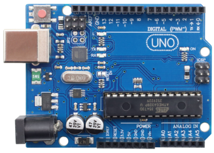 | Arduino UNO R3 board            | 1    |
| 2    | 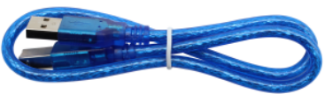 | USB cable                       | 1    |
| 3    | 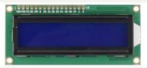 | 1602 LCD Display                | 1    |
| 4    | 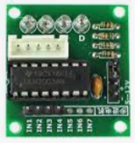 | Stepper motor drive board       | 1    |
| 5    | 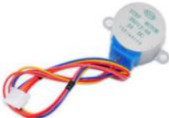 | Stepper Motor                   |      |
| 6    | 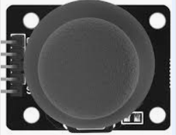 | Joystick Module                 | 1    |
| 7    | 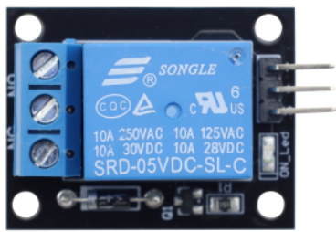 | Relay Module                    | 1    |
| 8    | 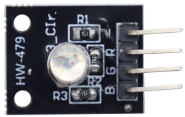 | RGB LED module                  | 1    |
| 9    | 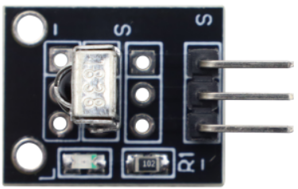 | IR Receiver Module              | 1    |
| 10   | 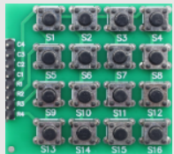 | 4*4 matrix keypad               | 1    |
| 11   | 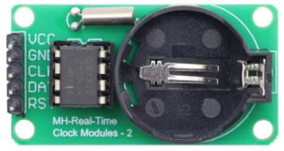 | Clock Module                    | 1    |
| 12   | 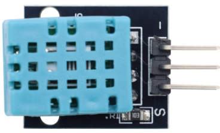 | Temperature and Humidity Sensor | 1    |
| 13   | 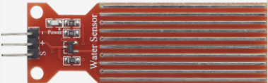 | Water sensor                    | 1    |
| 14   | 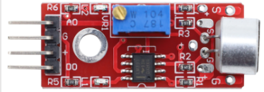 | Sound Sensor                    | 1    |
| 15   | 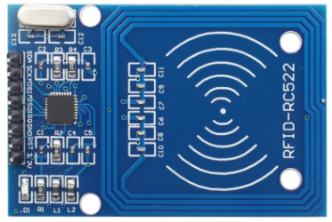 | RFID-RC522 Module               | 1    |
| 16   |  | RFID Card                       | 1    |
| 17   | 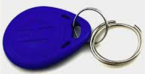 | Access Key                      | 1    |
| 18   | 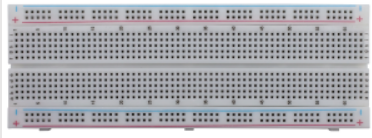 | 830-hole Breadboard             | 1    |
| 19   | 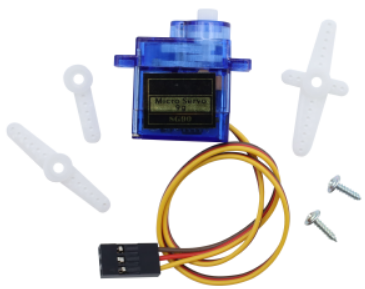 | Servo                           | 1    |
| 20   | 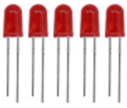 | LED - Red                       | 5    |
| 21   | 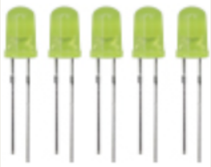 | LED - Yellow                    | 5    |
| 22   | 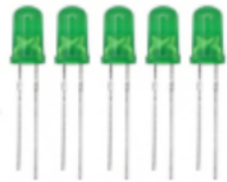 | LED - Green                     | 5    |
| 23   | 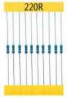 | 220Ω Resistor                   | 10   |
| 24   | 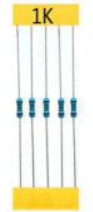 | 1K Resistor                     | 10   |
| 25   | 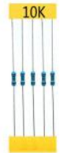 | 10K Resistor                    | 10   |
| 26   | 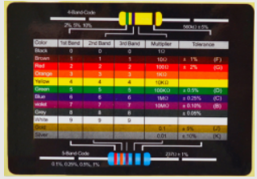 | Resistance Color Code Chart     | 1    |
| 27   | 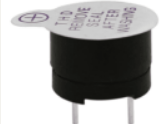 | Buzzer (active)                 | 1    |
| 28   | 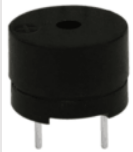 | Buzzer (passive)                | 1    |
| 29   | 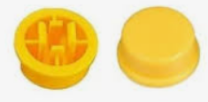 | Key cap                         | 5    |
| 30   | 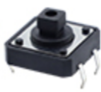 | Button Switch                   | 5    |
| 31   | 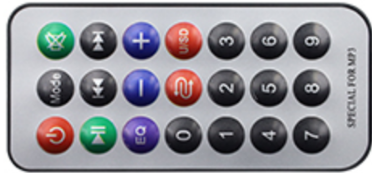 | Remote                          | 1    |
| 32   | 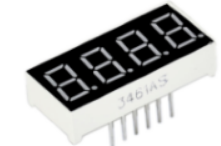 | 4-Digit 7-Seg Display           | 1    |
| 33   | 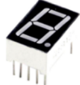 | 1 Digit 7-Seg Display           | 1    |
| 34   | 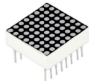 | 8*8 LED Dot Matrix              | 1    |
| 35   | 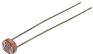 | Photo Resistor                  | 3    |
| 36   | 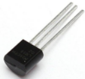 | LM35DZ Temp Sensor              | 1    |
| 37   | 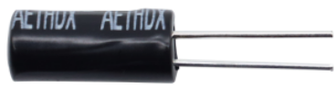 | Ball Tilt Sensor                | 2    |
| 38   | 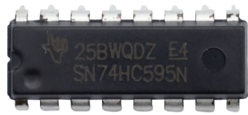 | IC 74HC595N 16-pin DIP          | 1    |
| 39   | 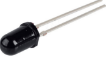 | Flame Sensor                    | 1    |
| 40   | 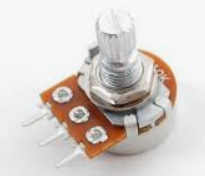 | Single-gang Pot                 | 1    |
| 41   | 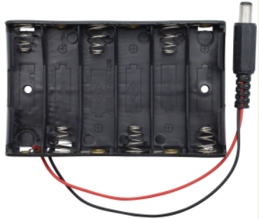 | AA Battery Holder               | 1    |
| 42   | 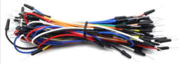 | Jumper Wires                    | 65   |
| 43   | 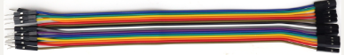 | Male to Female Dupont Wires     | 20   |
