.. _preface--introduction:

Preface & Introduction
======================

|image1|

.. _1introduction:

1.Introduction
--------------

Keyes RFID Starter Kit is an Arduino-compatible development kit designed
for beginners and electronics enthusiasts. This kit contains multiple
sensors and modules to help you get started quickly and practice a
variety of basic and intermediate electronics projects.

.. _2features:

2.Features
----------

1. **User-Friendliness**: Arduino is popular for its simplicity and ease
of use, allowing users to get started without needing advanced
programming or electronic expertise.

2. **Abundant Component Modules**: The kit includes various modules like
LEDs, sensors, displays, and motors, enabling users to undertake diverse
projects.

3. **Detailed Tutorials**: It offers detailed tutorials for 38 projects,
covering working principles, code, and wiring diagrams to help users
gradually master the basics.

4. **Versatile Applications**: The kit supports the creation of a wide
range of projects, from basic temperature monitoring to complex smart
home systems, greatly expanding its applicability.

5. **Expandability**: Beyond the basic projects in the tutorials, users
can explore and develop more advanced applications based on personal
interests. This flexibility significantly enhances the kit's practical
value.

.. _3component-list:

3.Component List
----------------

== ========= =============================== ===
#  PIC       NAME                            QTY
== ========= =============================== ===
1  |image2|  Arduino UNO R3 board            1
2  |image3|  USB cable                       1
3  |image4|  1602 LCD Display                1
4  |image5|  stepper motor drive board       1
5  |image6|  Stepper Motor                   1
6  |image7|  Joystick Module                 1
7  |image8|  Relay Module                    1
8  |image9|  RGB LED module                  1
9  |image10| IR Receiver Module              1
10 |image11| 4*4 matrix keypad               1
11 |image12| Clock Module                    1
12 |image13| Temperature and Humidity Sensor 1
13 |image14| Water sensor                    1
14 |image15| Sound Sensor                    1
15 |image16| RFID-RC522 Module               1
16 |image17| RFID Card                       1
17 |image18| Access Key                      1
18 |image19| 830-hole Breadboard             1
19 |image20| Servo                           1
20 |image21| LED - Red                       5
21 |image22| LED - Yellow                    5
22 |image23| LED - Green                     5
23 |image24| 220Ω Resistor                   10
24 |image25| 1K Resistor                     10
25 |image26| 10K Resistor                    10
26 |image27| Resistance Color Code Chart     1
27 |image28| Buzzer (active)                 1
28 |image29| Buzzer (passive)                1
29 |image30| Keycap                          5
30 |image31| Button Switch                   5
31 |image32| Remote                          1
32 |image33| 4-Digit 7-Seg Display           1
33 |image34| 1 Digit 7-Seg Display           1
34 |image35| 8*8 LED Dot Matrix              1
35 |image36| Photo Resistor                  3
36 |image37| LM35DZ Temp Sensor              1
37 |image38| Ball Tilt Sensor                2
38 |image39| IC 74HC595N 16-pin DIP          1
39 |image40| Flame Sensor                    1
40 |image41| Single-gang Pot                 1
41 |image42| AA Battery Holder               1
42 |image43| Jumper Wires                    65
43 |image44| Male to Female Dupont Wires     20
== ========= =============================== ===

.. |image1| image:: ./media/8c0d84819364932ba97e32d40fe0b580.jpeg
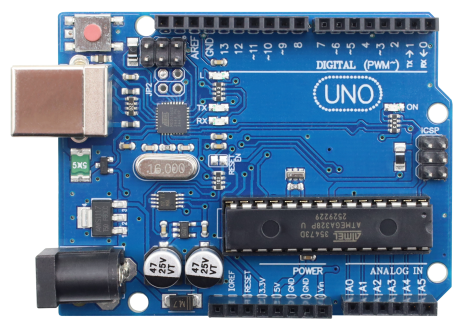
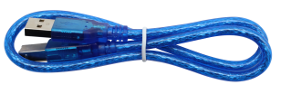
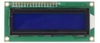
.. |image5| image:: ./media/7610a2e3cdb88821f0475d0caea046cc.png
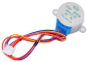
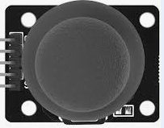
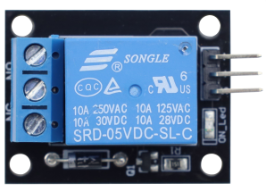
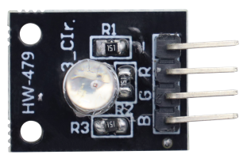
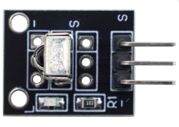
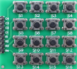
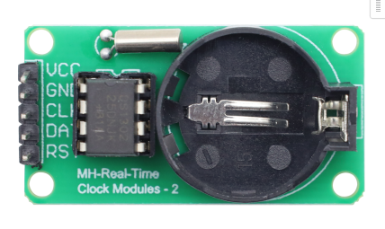
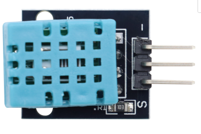
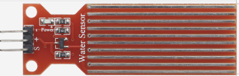
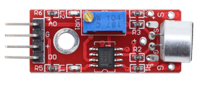
.. |image16| image:: ./media/Snipaste_2026-08-07_19-11-36.png

.. |image18| image:: ./media/3cf12a09749be4e06c4e1816421259d1.png
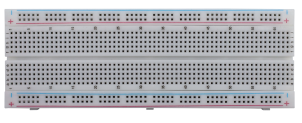
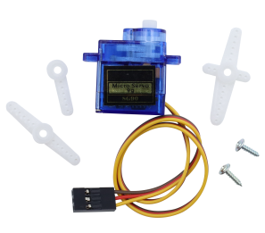
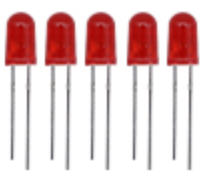
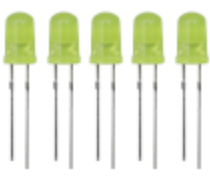
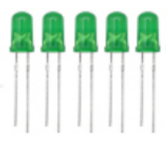
.. |image24| image:: ./media/a0b8757c0e991f8190854ee98f12b785.jpeg
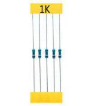
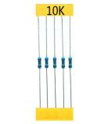
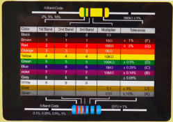
.. |image28| image:: ./media/60a660b4c23562a74563483b7af3f568.png
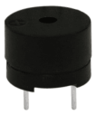
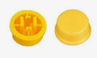
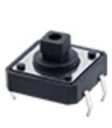
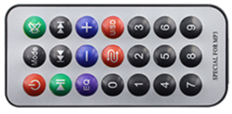
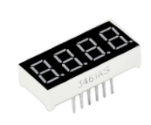
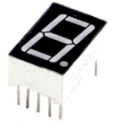
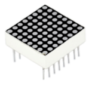
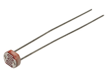
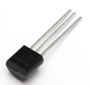
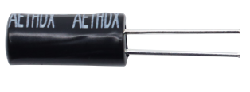
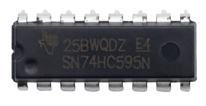
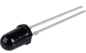
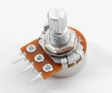
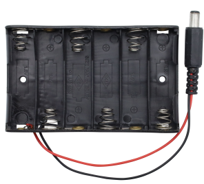
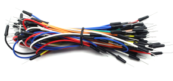
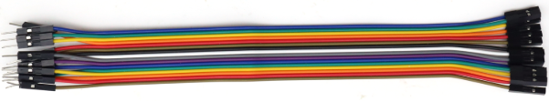
