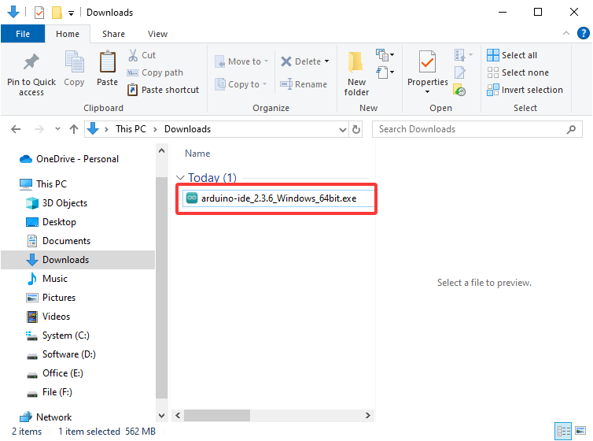
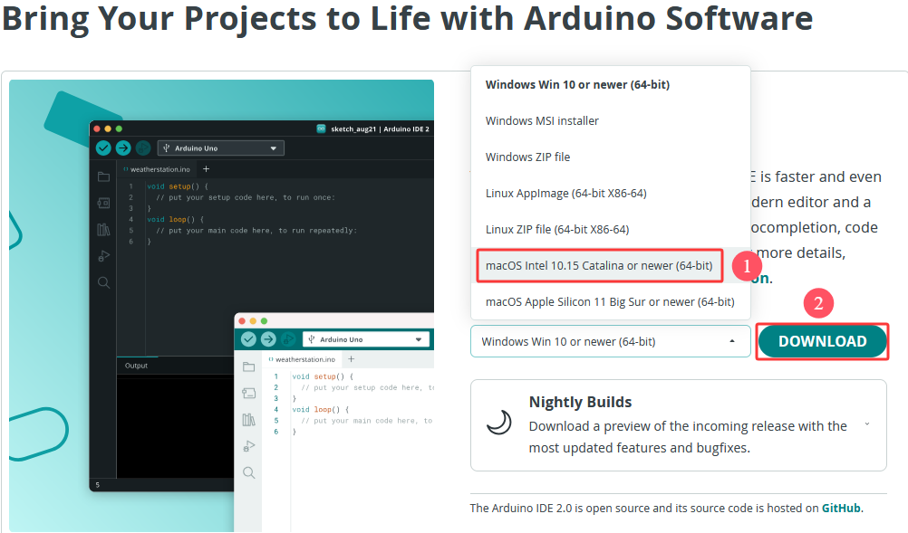
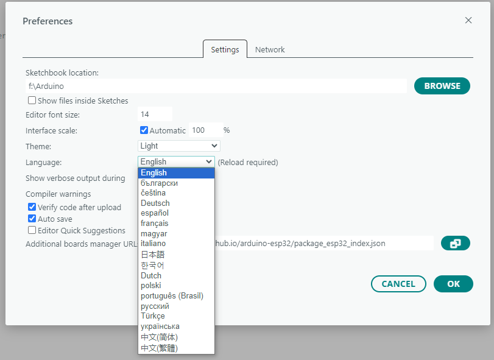
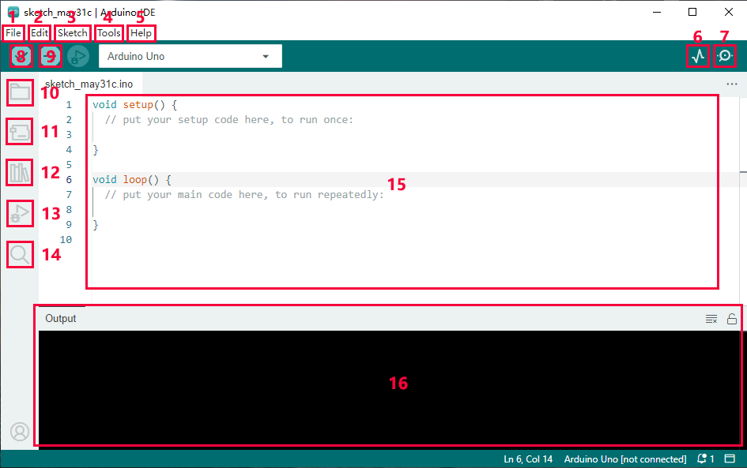
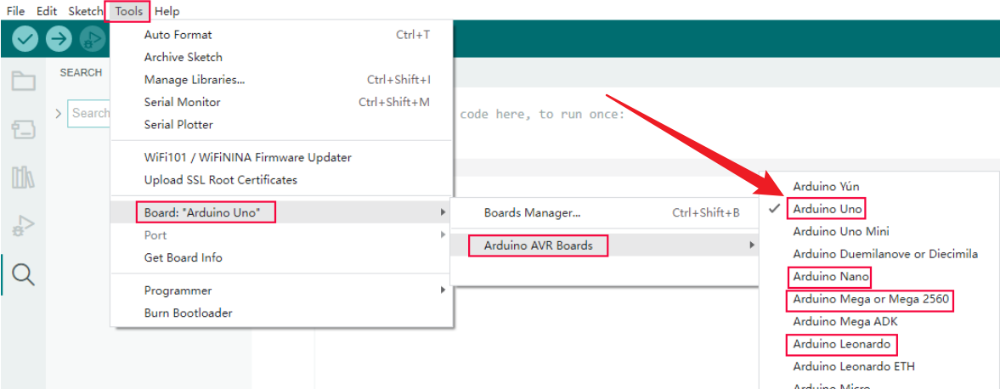
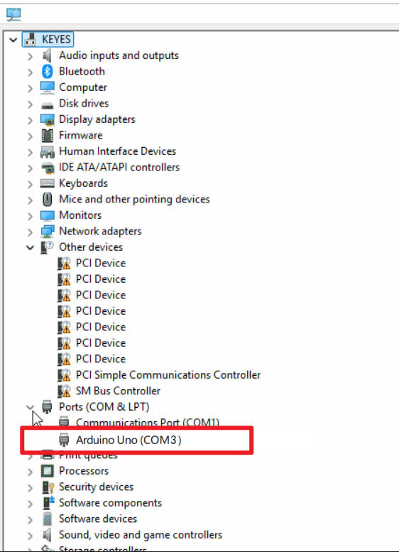
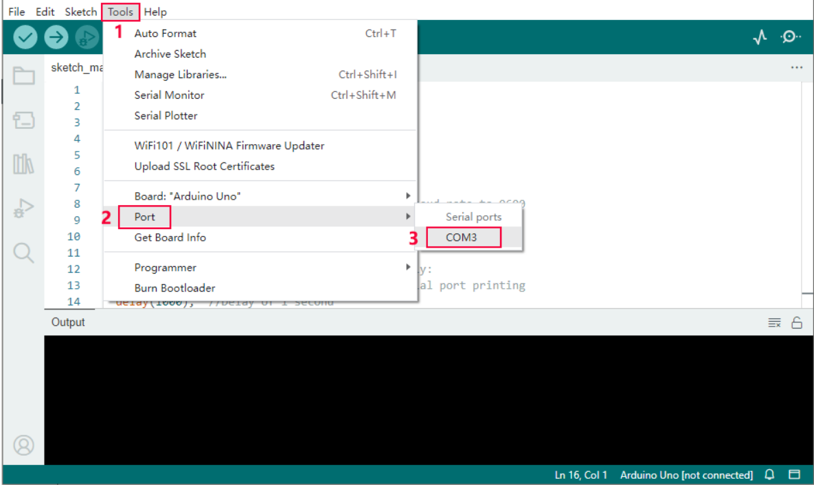
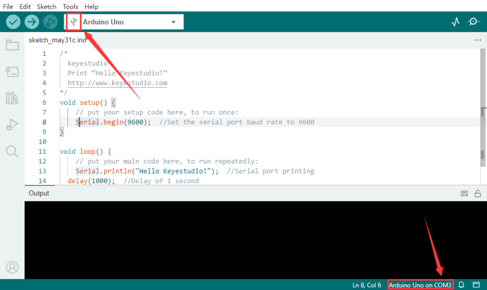
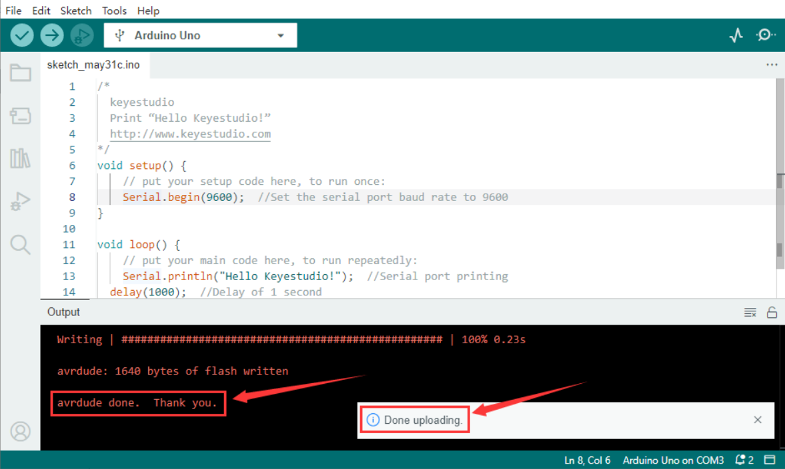
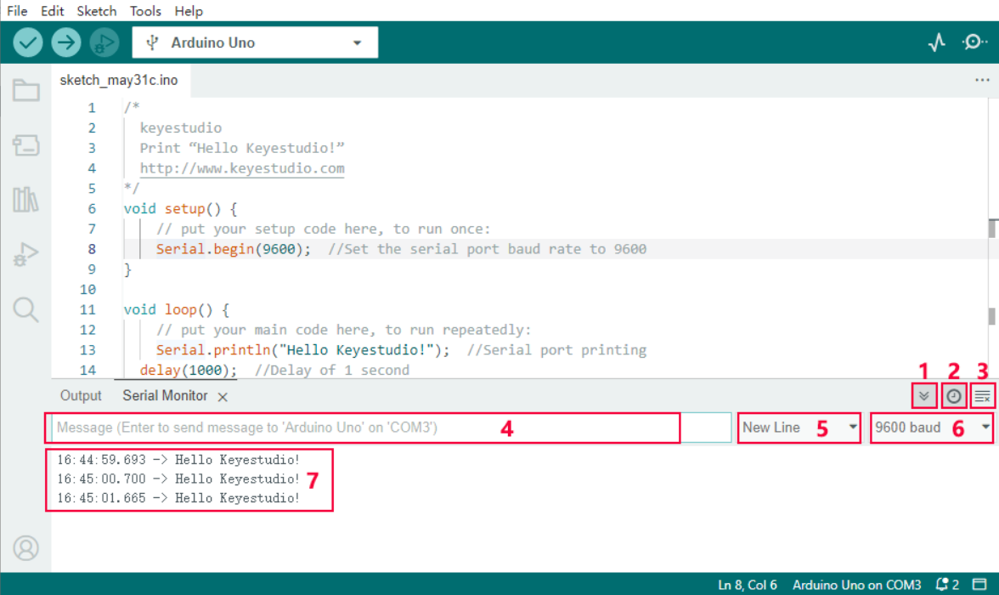

# Getting Started with Arduino

## 1. About Arduino IDE

Arduino IDE is an integrated development environment dedicated to Arduino which is an open-source electronics platform based on easy-to-read interface and simplified programming process, aimed at students without a background in electronics. 

Its clear interface, syntax highlighting and auto-completion functions make the programming process easy and enjoyable. It also offers a wealth of tutorials, sample codes, and community support to help beginners get started quickly and solve practical  problems.

Importantly, it is published as an open source tool. Therefore,  it not only accelerates users own learning process by utilizing and referring others’ works, it is also available for extension experienced programmers to freely access, modify and distribute codes.

In one word, Arduino IDE is easy-to-use for beginners, yet flexible enough for advanced users to take advantage of as well.

## 2. For Windows

**Attention please, the Arduino IDE version used here is 2.3.6. For other versions, the provided codes may not be compiled or uploaded.** 

### 2.1 Download Arduino IDE

Enter Arduino official to download [Software | Arduino](https://www.arduino.cc/en/software/).

Arduino boasts multiple versions such as Widows, mac and Linux(as shown below), please ensure that the one you download is compatible with your computer.

Here, we will take **Windows Win 10 or newer(64-bit)** as an example to introduce how to download it. You may also choose the **Windows ZIP file**.


Two versions are provided for Windows: for installing(Windows Win 10 or newer(64-bit)) and for downloading(Windows ZIP file, a zipped file, no need to install).

### 2.2 Install Arduino IDE

1\. Save the .exe file downloaded from the software page to your hard drive and simply run the file.



2\. Read the License Agreement and agree it.


3\. Choose the installation options.


4\. Choose the installation location.


5\. Click “finish” and run Arduino IDE.


## 3. For MacOS

### 3.1 Download Arduino IDE

Enter Arduino official to download [Software | Arduino](https://www.arduino.cc/en/software/).

Similar to Windows, here we will take **macOS Intel 10.15 Catalina or newer(64-bit)** as an example to introduce how to download it. You may also choose the **macOS Apple Silicon 11 Big Sur or newer(64-bit)**.



### 3.2 Install Arduino IDE

After then, click the file `arduino_ide_xxxx.dmg` and follow the instruction: copy and pastes the  **Arduino IDE.app** into **Applications**. A couple of seconds later, you can see the Arduino IDE icon.


## 4. Arduino IDE Language

⚠️ **Note that for different systems such as Windows and MAC, the language setting methods are not the same. The followings can be used as a reference.**

1\. Open Arduino IDE.


2\. Click “**File** ——>**Preferences...**”. In **Preferences**, click “**English**” to select a familiar language and “**OK**”.



## 5. Arduino IDE Page



1. **File** - includes new Sketch, open Sketch, open recently used code, open sample code, close the IDE, save code, preferences, advanced Settings, etc.
2. **Edit** - includes copy, paste, automatic formatting, font size, etc. (shortcut keys are recommended).
3. **Sketch** - includes verify\compile, upload code, import library and so on.
4. **Tools** - The most important two are development board and port.
5. **Help** - Views the IDE version and official reference documents.
6. **Open Serial Plotter** - displays serial data in a method of line graph
7. **Open Serial Monitor** - opens the Serial Monitor tool, as a new tab in the console.
8. **Verify** - compiles your code to your Arduino Board.
9. **Verify / Upload** - compiles and uploads your code to your Arduino Board.
10. **Sketchbook** - here you will find all of your sketches locally stored on your computer. Additionally, you can sync with the Arduino Cloud, and also obtain your sketches from the online environment.
11. **Boards Manager** - install or remove Arduino Boards .
12. **Library Manager** - browse through thousands of Arduino libraries or import local libraries
13. **Debugger** - test and debug programs in real time.
14. **Search** - search for keywords in your code.
15. **Code editing area**
16. **IDE prompt area** (Uploading fails or succeeds) & **Serial monitor display area**

## 6. Upload Code via Arduino IED

Upload code: An examples code is provided here: it will print “Hello Keyestudio!” per second.

Copy and paste the following code to Arduino IDE:

```c++
/*
keyestudio
Print “Hello Keyestudio!”
http://www.keyestudio.com
*/

void setup() {
// put your setup code here, to run once:

Serial.begin(9600); //Set the serial port baud rate to 9600
}

void loop() {
// put your main code here, to run repeatedly:
Serial.println("Hello Keyestudio!"); //Serial port printing
delay(1000); //Delay of 1 second
}
```


Click “Tools”——>“Board”——> Arduino AVR Boards, and here we choose Arduino Uno as our development board.



Choose the correct COM port.

If there are so many ports that you have no idea which is the correct one, you may unplug the board to check which one disappears. If there is no COM port, please check whether the driver is installed.



In our demostration, the port is COM3, so we click “Tools”to choose“COM3” in “Port”.



If your board is successfully connected, it will show on the interface.



Click to compile the code. If it succeeds, the following two show up:



Click and set baud rate to 9600, and “Hello Keyestudio!” are being printed!



1.“Toggle Autoscroll”: To set whether to follow the print.

2.“Toggle Timestamp”: To set whether to display printing time.

3.“Clear Output”: To clear the output data

4.Serial Input

5.Serial port sending format

6.Baud rate: To set the baud rate.

7.Printing box.

