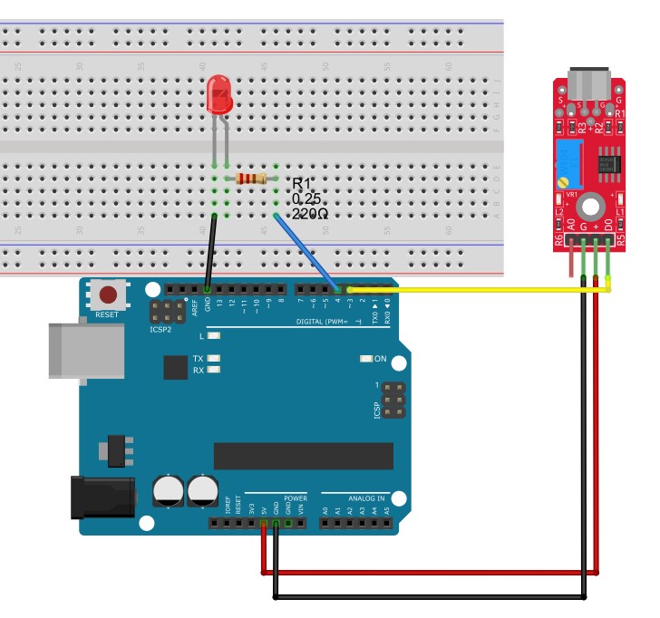

### Project 13 Sound Sensor Controlled LED

#### Description
Let's make a clap-controlled light! We will use the sound sensor's Digital Output (DO) to detect a loud noise (like a clap) and toggle an LED on and off. This is a classic interactive project that demonstrates how to use a sensor input to control an actuator output while maintaining state.

#### Hardware
- UNO R3 development board x1
- Sound Sensor Module (with DO pin) x1
- LED (any color) x1
- 220-ohm resistor x1
- Breadboard x1
- Jumper wires

#### Working Principle
This project builds upon the previous lesson. Instead of just printing to the Serial Monitor, the Arduino uses the digital signal (DO) from the sound sensor to toggle a boolean variable (`ledState`). When a loud sound is detected, the Arduino flips the state of this variable (from `false` to `true`, or `true` to `false`) and writes this new state to the LED pin. A crucial part of this project is the "debounce" delay. Because a single clap can create multiple sound waves that trigger the sensor rapidly, a short delay is added after a detection to ignore subsequent triggers for a fraction of a second, ensuring the LED toggles cleanly.

#### Specifications
- Sensor Trigger: Digital HIGH/LOW (DO pin)
- Actuator: 5mm LED
- Control Logic: State toggling with debounce

#### Wiring Diagram
| Component    | Pin | UNO R3 development board |
|--------------|-----|----------------|
| Sound Sensor | VCC | 5V             |
| Sound Sensor | GND | GND            |
| Sound Sensor | DO  | Digital Pin 3  |
| LED          | Anode (+) | Digital Pin 4 (via 220Ω resistor) |
| LED          | Cathode (-)| GND           |



#### Sample Code

```cpp
int soundPin = 3; // DO pin
int ledPin = 4;
boolean ledState = false; // Keep track of whether the LED is on or off

void setup() {
  pinMode(soundPin, INPUT);
  pinMode(ledPin, OUTPUT);
  
  // Ensure LED is off at startup
  digitalWrite(ledPin, LOW);
}

void loop() {
  int val = digitalRead(soundPin);
  
  // If sound is detected (Change to LOW if your sensor is active-low)
  if (val == HIGH) {
    ledState = !ledState; // Toggle the state (true becomes false, false becomes true)
    digitalWrite(ledPin, ledState); // Apply the new state to the LED
    
    // Debounce delay: wait half a second to avoid multiple triggers from one clap
    delay(500); 
  }
}
```

#### Code Explanation
- `boolean ledState = false;`: This variable remembers the current status of the LED.
- `ledState = !ledState;`: The `!` (NOT) operator flips the boolean value. This is the core logic for the toggle switch.
- `digitalWrite(ledPin, ledState);`: Turns the LED on if `ledState` is true (HIGH), and off if it's false (LOW).
- `delay(500);`: This is the debounce mechanism. It forces the Arduino to ignore the sound sensor for 500 milliseconds after a clap, preventing the LED from flickering rapidly during a single noise event.

#### Project Result
Upload the code. The LED should initially be off. Clap your hands loudly near the sensor. The LED should turn on and stay on. Clap again, and the LED should turn off. You have built a functional clap-switch!
