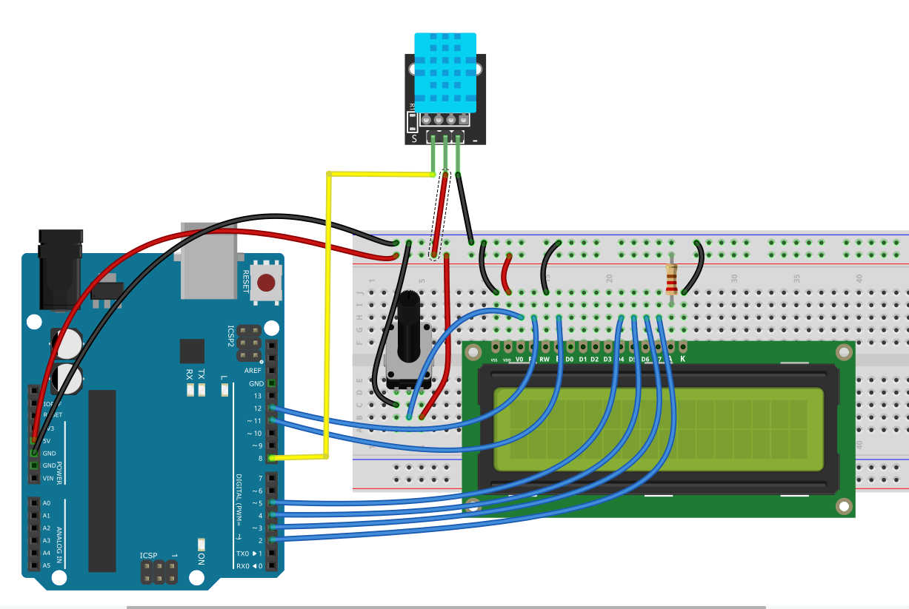

### Project 27 DHT11 + LCD Display

#### Description
Now that we know how to read data from the DHT11 sensor, let's display it on a standard 1602 LCD screen instead of the Serial Monitor. This creates a standalone digital thermometer and hygrometer! This project combines the environmental sensing capabilities of the DHT11 with the visual output of a parallel 1602 LCD.

#### Hardware
- UNO R3 development board x1
- DHT11 Sensor Module x1
- 1602 LCD Module (Standard Parallel, NOT I2C) x1
- 10k Potentiometer x1 (for LCD contrast)
- Breadboard x1
- Jumper wires

#### Working Principle
The project relies on two communication protocols: a custom single-wire protocol for the DHT11 and the standard parallel interface for the LCD. The Arduino acts as the master controller. It first sends a start signal to the DHT11, waits for the sensor's response, and then reads the 40-bit data packet containing temperature and humidity information. Once the data is processed, the Arduino formats it into strings and sends it over 6 digital pins (RS, EN, D4, D5, D6, D7) to the LCD module. The 10k potentiometer is used to adjust the contrast of the LCD screen.

#### Specifications
- Display: 16 characters x 2 lines (Parallel Interface)
- Sensor Update Rate: 2 seconds minimum


**The library was installed in Project 17. Refer to Lesson 17 for reinstallation if needed.**


#### Wiring Diagram

**1602 LCD Standard 16-Pin Interface:**
| No. | Mark | Pin Description | Connection |
|-----|------|-----------------|------------|
| 1   | VSS  | Power GND       | GND        |
| 2   | VDD  | Power positive  | 5V         |
| 3   | V0   | LCD voltage bias| Potentiometer Middle Pin |
| 4   | RS   | Data/Command    | Digital Pin 12 |
| 5   | R/W  | Read/Write      | GND        |
| 6   | E    | Enable signal   | Digital Pin 11 |
| 7   | D0   | Data I/O        | Not Connected |
| 8   | D1   | Data I/O        | Not Connected |
| 9   | D2   | Data I/O        | Not Connected |
| 10  | D3   | Data I/O        | Not Connected |
| 11  | D4   | Data I/O        | Digital Pin 5 |
| 12  | D5   | Data I/O        | Digital Pin 4 |
| 13  | D6   | Data I/O        | Digital Pin 3 |
| 14  | D7   | Data I/O        | Digital Pin 2 |
| 15  | A    | Backlight (+)   | 5V         |
| 16  | K    | Backlight (-)   | GND        |

*Note: The two outer pins of the 10K potentiometer connect to 5V and GND.*

**DHT11 Sensor:**

- VCC to 5V

- GND to GND

- DATA to Digital Pin 8

  

#### Sample Code
```cpp
#include <LiquidCrystal.h>
#include <DHT.h>

// Initialize the LCD with the numbers of the interface pins
// LiquidCrystal lcd(RS, E, D4, D5, D6, D7);
LiquidCrystal lcd(12, 11, 5, 4, 3, 2);

#define DHT11_PIN 8
DHT dht(DHT11_PIN, DHT11);   // DHT dht;

void setup() {
  // Set up the LCD's number of columns and rows:
  lcd.begin(16, 2);
  
  dht.begin();   // This library must be initialized.

  // Print a welcome message
  lcd.setCursor(0, 0);
  lcd.print("Temp & Humidity");
  lcd.setCursor(0, 1);
  lcd.print("Initializing...");
  delay(2000);
  lcd.clear();
}

void loop() {
  // Read data from the sensor
  float temperature = dht.readTemperature();
  float humidity = dht.readHumidity();

  // Display Temperature on the first line
  lcd.setCursor(0, 0);
  lcd.print("Temp: ");
  lcd.print(temperature, 1); // Print with 1 decimal place
  lcd.print(" C");
  
  // Display Humidity on the second line
  lcd.setCursor(0, 1);
  lcd.print("Hum:  ");
  lcd.print(humidity, 1);    // Print with 1 decimal place
  lcd.print(" %");
  
  // Wait 2 seconds before the next reading
  delay(2000);
}
```

#### Code Explanation

- `#include <LiquidCrystal.h>`: Includes the built-in library for standard parallel LCDs.
- `#include <DHT.h>`: Includes the DHT sensor library to read temperature and humidity data.
- `LiquidCrystal lcd(12, 11, 5, 4, 3, 2);`: Creates an LCD object and specifies which Arduino pins are connected to the LCD's RS, EN, D4, D5, D6, and D7 pins.
- `#define DHT11_PIN 8`: Defines the digital pin connected to the DHT11 data line.
- `DHT dht(DHT11_PIN, DHT11);`: Creates a DHT sensor object, sets the data pin and selects the DHT11 sensor model.
- `lcd.begin(16, 2)`: Initializes the display dimensions (16 columns, 2 rows).
- `dht.begin()`: Starts communication with the DHT sensor; required for the new Adafruit DHT library.
- `lcd.setCursor(col, row)`: Moves the cursor to the specified column and row (0-indexed).
- `dht.readTemperature()`, `dht.readHumidity()`: Reads real-time temperature and humidity values from the sensor.
- `lcd.print(temperature, 1)`: Prints the measured value with exactly 1 decimal place for a cleaner look.

#### Project Result

After uploading the code, adjust the potentiometer until the text on the LCD is clearly visible. The screen will display a welcome message for 2 seconds. Then, it will show the real-time temperature on the top row and the humidity on the bottom row. The values will update every 2 seconds.
