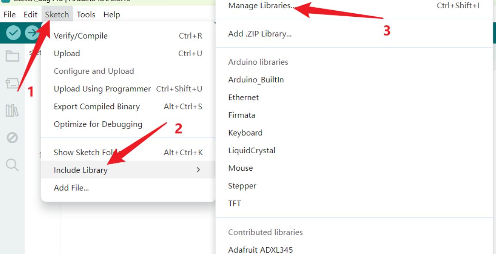
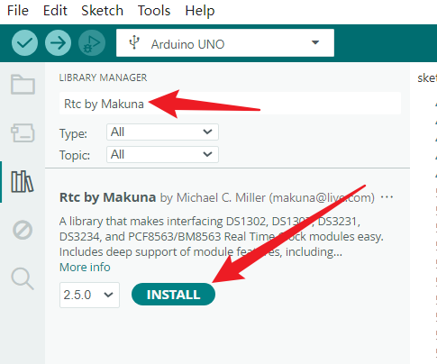
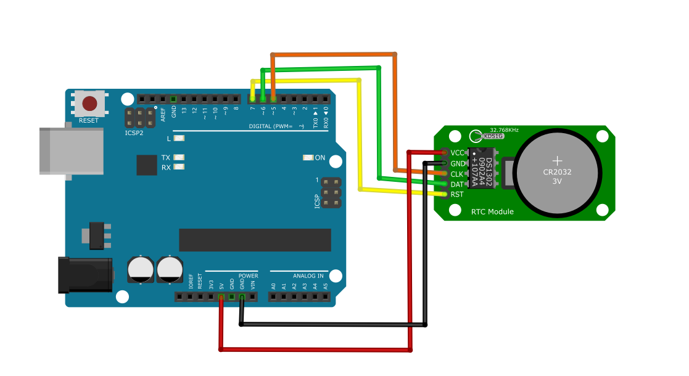

### Project 28  DS1302 RTC Module

#### Description
The DS1302 is a Real-Time Clock (RTC) module that keeps track of the current time and date. It has a backup battery (usually a CR2032 coin cell) so it continues to keep time even when the Arduino is powered off or disconnected from the computer. In this project, we will learn how to set the time on the DS1302 and read it back to the Serial Monitor.

#### Hardware
- UNO R3 development board x1
- DS1302 RTC Module x1
- Breadboard x1
- Jumper wires

#### Working Principle
The DS1302 contains a real-time clock/calendar and 31 bytes of static RAM. It communicates with a microprocessor via a simple serial interface. The real-time clock/calendar provides seconds, minutes, hours, day, date, month, and year information. The end of the month date is automatically adjusted for months with fewer than 31 days, including corrections for leap year. The clock operates in either the 24-hour or 12-hour format with an AM/PM indicator. The module uses a 32.768 kHz crystal oscillator to maintain accurate timekeeping.

#### Specifications
- Operating Voltage: 2.0V to 5.5V
- Interface: 3-wire synchronous serial (CE, I/O, SCLK)
- Backup Battery: CR2032 (3V)
- Features: Leap year compensation valid up to 2100

#### Library Installation
This project requires the  library.
1. Open the Arduino IDE.

2. Go to **Sketch** -> **Include Library** -> **Manage Libraries...**

   

3. In the Library Manager search bar, type `Rtc by Makuna`. and click **Install**.

   

#### Wiring Diagram
| DS1302 Module | UNO R3 development board |
|---------------|----------------|
| VCC           | 5V             |
| GND           | GND            |
| CLK (SCLK)    | Digital Pin 5  |
| DAT (I/O)     | Digital Pin 6  |
| RST (CE)      | Digital Pin 7  |



#### Sample Code

```cpp
/*

Keye New RFID Starter Kit

Project 28

DS1302 RTC Module

Edit By Keyes

*/
#include <ThreeWire.h>  
#include <RtcDS1302.h>

// Wiring: IO -> 6, SCLK -> 5, CE(RST) -> 7
ThreeWire myWire(6, 5, 7);
RtcDS1302<ThreeWire> Rtc(myWire);

void setup() {
  Serial.begin(115200);
  Rtc.Begin();

  // Check if RTC works properly
  if (!Rtc.IsDateTimeValid()) {
    Serial.println("⚠️ RTC time invalid, initializing with compile time...");
    // This line sets the time to the computer time when the code is compiled and uploaded
    Rtc.SetDateTime(RtcDateTime(__DATE__, __TIME__));
  }

  // Uncomment this line to set custom time.
  // Comment it out again after setting, otherwise the time will reset to this value every power-up.
  // Rtc.SetDateTime(RtcDateTime(2026, 8, 14, 15, 30, 0));
}

void loop() {
  RtcDateTime now = Rtc.GetDateTime();

  // Print date and time
  Serial.print(now.Year());
  Serial.print("-");
  printWithZero(now.Month());
  Serial.print("-");
  printWithZero(now.Day());
  Serial.print(" ");
  printWithZero(now.Hour());
  Serial.print(":");
  printWithZero(now.Minute());
  Serial.print(":");
  printWithZero(now.Second());
  Serial.println();

  delay(1000);
}

// Helper function: add leading zero for single-digit numbers
void printWithZero(uint8_t num) {
  if (num < 10) Serial.print("0");
  Serial.print(num);
}

```

#### Code Explanation

**Include Library Files**

```
#include <ThreeWire.h>  
#include <RtcDS1302.h>
```

`ThreeWire.h`: Provides three-wire communication driver for communicating with the DS1302 clock chip. `RtcDS1302.h`: Dedicated function library for the DS1302 real-time clock.

**Communication Pin Configuration & Create RTC Instance**

```
ThreeWire myWire(6, 5, 7);
RtcDS1302<ThreeWire> Rtc(myWire);
```

Instantiate the three-wire communication object, configuring IO, SCLK, CE (RST) pins in sequence. Then create the DS1302 clock object, which handles all subsequent clock read and write operations.

**Initialization Function setup()**

```
void setup() {
  Serial.begin(115200);
  Rtc.Begin();

  if (!Rtc.IsDateTimeValid()) {
    Serial.println("⚠️ RTC time invalid, initializing with compile time...");
    Rtc.SetDateTime(RtcDateTime(__DATE__, __TIME__));
  }

  // Rtc.SetDateTime(RtcDateTime(2026, 8, 14, 15, 30, 0));
}
```

`Serial.begin(115200);`: Initialize serial port with baud rate 115200. `Rtc.Begin();`: Start communication with the DS1302 clock module. `Rtc.IsDateTimeValid()`: Check whether the time stored in the module is valid; time becomes invalid when the battery runs out or on first use. `Rtc.SetDateTime(RtcDateTime(__DATE__, __TIME__));`: Read the computer time at the moment of code compilation and write it to the clock chip automatically. `Rtc.SetDateTime(RtcDateTime(year,month,day,hour,minute,second));`: Manually set the specified time. It is recommended to comment out this line after configuration to prevent time reset on every power-up.

**Main Loop Function loop()**

```
void loop() {
  RtcDateTime now = Rtc.GetDateTime();

  Serial.print(now.Year());
  Serial.print("-");
  printWithZero(now.Month());
  Serial.print("-");
  printWithZero(now.Day());
  Serial.print(" ");
  printWithZero(now.Hour());
  Serial.print(":");
  printWithZero(now.Minute());
  Serial.print(":");
  printWithZero(now.Second());
  Serial.println();

  delay(1000);
}
```

`RtcDateTime now = Rtc.GetDateTime();`: Read the current time from DS1302 and store it in the time object. `now.Year() / Month() / Day() / Hour() / Minute() / Second()`: Obtain the value of year, month, day, hour, minute and second respectively. `delay(1000);`: Refresh the time once every second.

**Custom Helper Function printWithZero()**

```
void printWithZero(uint8_t num) {
  if (num < 10) Serial.print("0");
  Serial.print(num);
}
```

Automatically add a leading zero when the value is less than 10 (single-digit month, date, hour, minute or second) to ensure consistent output format, e.g. `08:05:03` instead of `8:5:3`.


#### Project Result
If this is your first time using the module, uncomment the time-setting lines in `setup()`, adjust them to the current time, and upload. Then, comment them out and upload again. Open the Serial Monitor, and you will see the current day, date, and time updating every second, like a digital clock.
