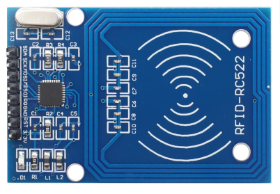
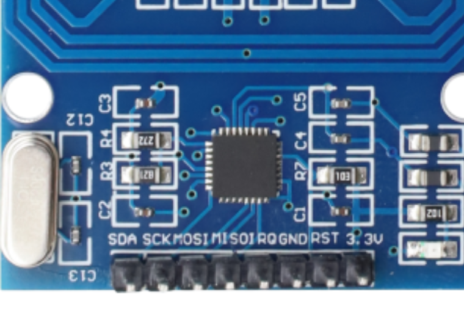
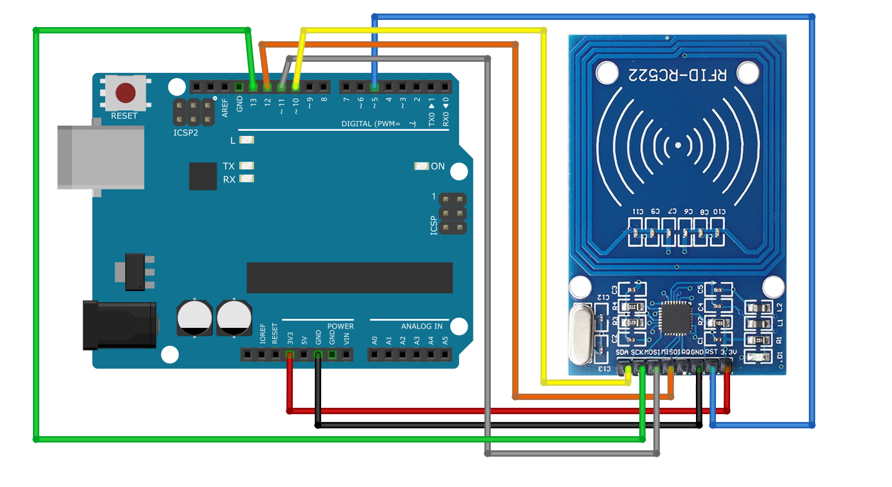
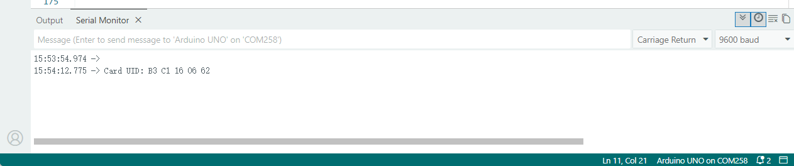

### Project 37 RFID Module



#### Description

An RFID module integrates radio frequency identification technology that identify and track tagged objects by electromagnetic fields. Each tag contains a microchip that stores unique identifying information about the object. The module identifies the object by reading the tag information and can match it with the database to track and manage the object.

In this project, we read the unique ID by UNO R3 development board and RC522 RFID module, and then perform the corresponding action based on the read ID.

#### Hardware

1\. UNO R3 development board x1

2\. RC522 RFID module x1

3\. RFID card (key or card) x1

4\. DuPont wires

#### Working Principle

An RFID or radio frequency identification system consists of two main components, a tag attached to the object to be identified, and a reader that reads the tag.

A reader consists of a radio frequency module and an antenna that generates a high frequency electromagnetic field. Whereas the tag is usually a passive device (it does not have a battery). It consists of a microchip that stores and processes information, and an antenna for receiving and transmitting a signal.


When the tag is brought close to the reader, the reader generates an electromagnetic field. This causes electrons to move through the tag’s antenna and subsequently powers the chip.

The chip then responds by sending its stored information back to the reader in the form of another radio signal. This is called a backscatter. The reader detects and interprets this backscatter and sends the data to a computer or microcontroller.

#### Specifications

| Frequency Range          | 13.56 MHz ISM Band |
|--------------------------|--------------------|
| Host Interface           | SPI / I2C / UART   |
| Operating Supply Voltage | 2.5 V to 3.3 V     |
| Max. Operating Current   | 13-26mA            |
| Min. Current(Power down) | 10µA               |
| Logic Inputs             | 5V Tolerant        |
| Read Range               | 5 cm               |

#### Pinout



VCC supplies power to the module. This can be anywhere from 2.5 to 3.3 volts. You can connect it to the 3.3V output from your Arduino. But remember that connecting it to the 5V pin will probably destroy your module!

RST is an input for reset and power-down. When this pin goes low the module enters power-down mode. In which the oscillator is turned off and the input pins are disconnected from the outside world. Whereas the module is reset on the rising edge of the signal.

GND is the ground pin and needs to be connected to the GND pin on the Arduino.

IRQ is an interrupt pin that alerts the microcontroller when an RFID tag is in the vicinity.

MISO / SCL / Tx pin acts as master-in-slave-out when SPI interface is enabled, as serial clock when I2C interface is enabled and as serial data output when the UART interface is enabled.

MOSI (Master Out Slave In) is the SPI input to the RC522 module.

SCK (Serial Clock) accepts the clock pulses provided by the SPI bus master i.e. Arduino.

SS / SDA / Rx pin acts as a signal input when the SPI interface is enabled, as serial data when the I2C interface is enabled and as a serial data input when the UART interface is enabled. This pin is usually marked by encasing the pin in a square so that it can be used as a reference to identify other pins.

#### Wiring Diagram

First connect the VCC pin on the module to 3.3V and the GND pin to ground on the Arduino. Pin RST can be connected to any digital pin on the Arduino. In our case, it is connected to digital pin \#5. The IRQ pin is left unconnected because the Arduino library we are going to use does not support it.

Now we are left with the pins that are used for SPI communication. Since RC522 modules require a lot of data transfer, they will give the best performance when connected to the hardware SPI pins on the microcontroller. For Arduino boards such as the UNO/Nano V3.0, these pins are digital 13 (SCK), 12 (MISO), 11 (MOSI) and 10 (SS).

If you are using a different Arduino than the boards mentioned above, please check the Arduino’s official documentation before proceeding.

The following table lists the pin connections:

| RC522 Module    |   | Arduino |
|-----------------|---|---------|
| VCC             |   | 3.3V    |
| GND             |   | GND     |
| RST             |   | 5       |
| MISO / SCL / Tx |   | 12      |
| MOSI            |   | 11      |
| SCK             |   | 13      |
| SS / SDA / Rx   |   | 10      |




#### Sample Code

```cpp

/*
Keye New RFID Starter Kit
Project 37
RFID module
Edit By Keyes
*/

#include <SPI.h>

#define RST_PIN   5
#define SS_PIN    10
#define MAX_LEN   16   

// ================== Register Definition ==================
#define CommandReg     0x01
#define ComIrqReg      0x04
#define DivIrqReg      0x05
#define ErrorReg       0x06
#define FIFODataReg    0x09
#define FIFOLevelReg   0x0A
#define BitFramingReg  0x0D
#define ModeReg        0x11
#define TxControlReg   0x14
#define TxAutoReg      0x15
#define TModeReg       0x2A
#define TPrescalerReg  0x2B
#define TReloadRegL    0x2C
#define TReloadRegH    0x2D

#define PCD_IDLE       0x00
#define PCD_AUTHENT    0x0E
#define PCD_TRANSCEIVE 0x0C
#define PCD_RESETPHASE 0x0F

#define PICC_ANTICOLL  0x93
#define PICC_REQIDL    0x26

#define MI_OK          0
#define MI_ERR         2

// ================== Low-level SPI Read & Write ==================
void Write_MFRC522(byte addr, byte val) {
  digitalWrite(SS_PIN, LOW);
  SPI.transfer((addr << 1) & 0x7E);
  SPI.transfer(val);
  digitalWrite(SS_PIN, HIGH);
}

byte Read_MFRC522(byte addr) {
  byte val;
  digitalWrite(SS_PIN, LOW);
  SPI.transfer(((addr << 1) & 0x7E) | 0x80);
  val = SPI.transfer(0x00);
  digitalWrite(SS_PIN, HIGH);
  return val;
}

void SetBitMask(byte reg, byte mask) {
  Write_MFRC522(reg, Read_MFRC522(reg) | mask);
}

void ClearBitMask(byte reg, byte mask) {
  Write_MFRC522(reg, Read_MFRC522(reg) & (~mask));
}

void AntennaOn() {
  if (!(Read_MFRC522(TxControlReg) & 0x03)) {
    SetBitMask(TxControlReg, 0x03);
  }
}

void MFRC522_Reset() {
  Write_MFRC522(CommandReg, PCD_RESETPHASE);
}

void MFRC522_Init() {
  digitalWrite(RST_PIN, HIGH);
  MFRC522_Reset();
  
  Write_MFRC522(TModeReg, 0x8D);
  Write_MFRC522(TPrescalerReg, 0x3E);
  Write_MFRC522(TReloadRegL, 30);
  Write_MFRC522(TReloadRegH, 0);
  Write_MFRC522(TxAutoReg, 0x40);
  Write_MFRC522(ModeReg, 0x3D);
  AntennaOn();
}

// ================== Core Functions ==================
byte MFRC522_Request(byte reqMode, byte *TagType) {
  byte status;
  unsigned int backBits;
  Write_MFRC522(BitFramingReg, 0x07);
  TagType[0] = reqMode;
  status = MFRC522_ToCard(PCD_TRANSCEIVE, TagType, 1, TagType, &backBits);
  if ((status != MI_OK) || (backBits != 0x10)) status = MI_ERR;
  return status;
}

byte MFRC522_ToCard(byte command, byte *sendData, byte sendLen, byte *backData, unsigned int *backLen) {
  byte status = MI_ERR;
  byte irqEn = 0x00;
  byte waitIRq = 0x00;
  byte n;
  unsigned int i;
  
  if (command == PCD_AUTHENT) { irqEn = 0x12; waitIRq = 0x10; }
  if (command == PCD_TRANSCEIVE) { irqEn = 0x77; waitIRq = 0x30; }
  
  Write_MFRC522(ComIrqReg, 0x80);
  ClearBitMask(ComIrqReg, 0x80);
  SetBitMask(FIFOLevelReg, 0x80);
  Write_MFRC522(CommandReg, PCD_IDLE);
  
  for (i = 0; i < sendLen; i++) Write_MFRC522(FIFODataReg, sendData[i]);
  
  Write_MFRC522(CommandReg, command);
  if (command == PCD_TRANSCEIVE) SetBitMask(BitFramingReg, 0x80);
  
  i = 2000;
  do {
    n = Read_MFRC522(ComIrqReg);
    i--;
  } while ((i != 0) && !(n & 0x01) && !(n & waitIRq));
  
  ClearBitMask(BitFramingReg, 0x80);
  
  if (i != 0) {
    if (!(Read_MFRC522(ErrorReg) & 0x1B)) {
      status = MI_OK;
      if (n & irqEn & 0x01) status = MI_ERR;
      if (command == PCD_TRANSCEIVE) {
        n = Read_MFRC522(FIFOLevelReg);
        byte lastBits = Read_MFRC522(0x0C) & 0x07;
        if (lastBits) *backLen = (n - 1) * 8 + lastBits;
        else *backLen = n * 8;
        if (n == 0) n = 1;
        if (n > MAX_LEN) n = MAX_LEN;
        for (i = 0; i < n; i++) backData[i] = Read_MFRC522(FIFODataReg);
      }
    } else status = MI_ERR;
  }
  return status;
}

byte MFRC522_Anticoll(byte *serNum) {
  byte status;
  byte i;
  byte serNumCheck = 0;
  unsigned int unLen;
  Write_MFRC522(BitFramingReg, 0x00);
  serNum[0] = PICC_ANTICOLL;
  serNum[1] = 0x20;
  status = MFRC522_ToCard(PCD_TRANSCEIVE, serNum, 2, serNum, &unLen);
  if (status == MI_OK) {
    for (i = 0; i < 4; i++) serNumCheck ^= serNum[i];
    if (serNumCheck != serNum[i]) status = MI_ERR;
  }
  return status;
}

// ================== setup & loop ==================
void setup() {
  Serial.begin(9600);
  SPI.begin();
  
  pinMode(SS_PIN, OUTPUT);
  digitalWrite(SS_PIN, HIGH);
  pinMode(RST_PIN, OUTPUT);
  digitalWrite(RST_PIN, HIGH);
  
  MFRC522_Init();
  Serial.println("RFID reader ready. Please place card...");
}

void loop() {
  byte status;
  byte str[2];          // Stores card type, occupies 2 bytes
  byte serNum[5];       // Stores UID (5 bytes)
  
  // Search for card
  status = MFRC522_Request(PICC_REQIDL, str);
  if (status != MI_OK) {
    delay(100);
    return;
  }
  
  // Anti-collision and obtain UID
  status = MFRC522_Anticoll(serNum);
  if (status == MI_OK) {
    Serial.print("Card UID: ");
    for (byte i = 0; i < 5; i++) {
      if (serNum[i] < 0x10) Serial.print("0");
      Serial.print(serNum[i], HEX);
      if (i < 4) Serial.print(" ");
    }
    Serial.println();
  }
  
  delay(1000);
}

```


#### Code Explanation

**Include Libraries**

```
#include <SPI.h>
```

`SPI.h` is used for Serial Peripheral Interface (SPI) communication with the RFID module. No external MFRC522 library is used; all driver functions are implemented manually.

**Define Pins and Constants**

```
#define RST_PIN   5
#define SS_PIN    10
#define MAX_LEN   16
```

`RST_PIN` and `SS_PIN` define the reset pin and slave select pin for the RFID module. `MAX_LEN` sets the maximum buffer length for RFID data transmission. A full set of MFRC522 register addresses, command codes and status constants are defined to operate the chip directly.

**Function Implementation** Low-level functions such as `Write_MFRC522()` and `Read_MFRC522()` realize SPI register access. Supporting functions complete hardware reset and antenna activation. Core functions `MFRC522_Request()` and `MFRC522_Anticoll()` implement card detection, anti-collision and UID acquisition.

**Initial Setup**

```
void setup() {
  Serial.begin(9600);
  SPI.begin();
  pinMode(SS_PIN, OUTPUT);
  digitalWrite(SS_PIN, HIGH);
  pinMode(RST_PIN, OUTPUT);
  digitalWrite(RST_PIN, HIGH);
  MFRC522_Init();
  Serial.println("RFID reader ready. Please place card...");
}
```

`Serial.begin(9600);` initializes serial communication at a baud rate of 9600. `SPI.begin();` starts the SPI bus. Pin modes for SS and RST are configured as output. `MFRC522_Init();` performs register configuration and initializes the MFRC522 reader. A ready prompt is printed on the serial monitor.

**Main Loop**

```
void loop() {
  byte status;
  byte str[2];
  byte serNum[5];

  status = MFRC522_Request(PICC_REQIDL, str);
  if (status != MI_OK) {
    delay(100);
    return;
  }

  status = MFRC522_Anticoll(serNum);
  if (status == MI_OK) {
    Serial.print("Card UID: ");
    for (byte i = 0; i < 5; i++) {
      if (serNum[i] < 0x10) Serial.print("0");
      Serial.print(serNum[i], HEX);
      if (i < 4) Serial.print(" ");
    }
    Serial.println();
  }
  delay(1000);
}
```

`MFRC522_Request()` detects whether a card is within induction range. If no card is found, the loop restarts. `MFRC522_Anticoll()` obtains the card’s raw UID after successful detection. The program prints the UID in hexadecimal format to the serial monitor. A short delay is added before the next detection cycle.

#### Project Result

Now upload the sketch and open Serial Monitor. As you bring the tag closer to the module, you’ll get something like the following. Do not move the tag until all the information is displayed.



It displays all the useful information about the tag including the tag’s Unique ID (UID), memory size, and the entire 1K memory.

