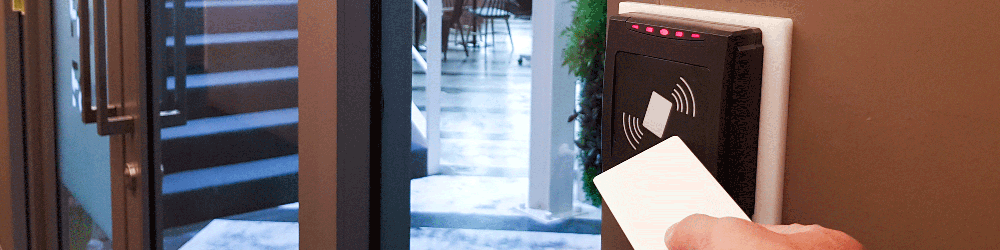
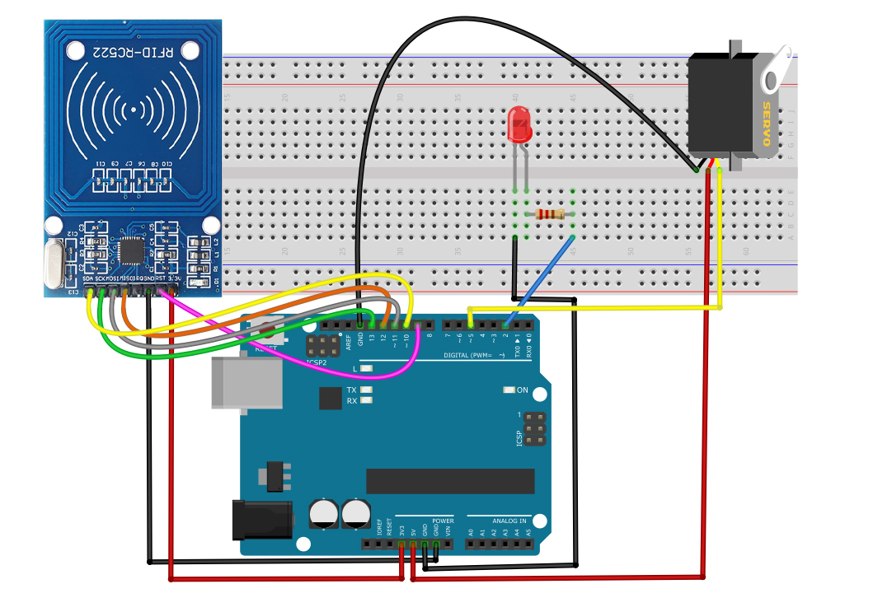

### Project 38 RFID Smart Home


#### Description

Automatic features and security are two crucial aspects of modern smart home systems. By utilizing RFID technology, we can create a secure and convenient home automation system. In this project, we will use an RFID module to control a servo motor and LED lights on an Arduino. This system can be configured, for example, to turn the lights on or off in a particular room or unlock a door lock by scanning an RFID card.

#### Hardware

1.UNO R3 development board x1

2.RFID Reader Module (e.g., MFRC522) x1

3.RFID card or tag x1

4.Servo Motor x1

5.LED light x1

6.220-ohm resistor x1

7.Breadboard and connecting wires


#### Working Principle

In this project, the RFID module will be connected to the Arduino to read the UID of an RFID card. When the RFID reader detects a specific RFID card, the Arduino will control the servo motor to rotate and turn the LED light on or off. The core idea is to implement switch control of specific devices when the RFID card is successfully verified.

#### Wiring Diagram

1\. **Connecting Arduino Pins to RFID Module Pins**:

SDA → D10

SCK → D13

MOSI → D11

MISO → D12

IRQ → Not connected

GND → GND

RST → D9

3.3V → 3.3V

2\. **Connecting Arduino Pins to the Servo**:

Servo signal wire → D5

Servo power wire → 5V

Servo ground wire → GND

3\. **Connecting Arduino Pins to the LED**:

LED anode (long leg) → D2

LED cathode (short leg) → Resistor → GND



#### Sample Code

```cpp

/*
Keye New RFID Starter Kit
Project 38
RFID Smart Home
Edit By Keyes
*/

#include <SPI.h>
#include <Servo.h>

#define TARGET_UID "04 3A 8F 12 34"   // Replace with your card UID 

#define SS_PIN    10
#define RST_PIN   5
#define LED_PIN   2
#define SERVO_PIN 9
#define MAX_LEN   16

Servo myServo;

// ================== Register Definition ==================
#define CommandReg     0x01
#define ComIrqReg      0x04
#define DivIrqReg      0x05
#define ErrorReg       0x06
#define FIFODataReg    0x09
#define FIFOLevelReg   0x0A
#define BitFramingReg  0x0D
#define ModeReg        0x11
#define TxControlReg   0x14
#define TxAutoReg      0x15
#define TModeReg       0x2A
#define TPrescalerReg  0x2B
#define TReloadRegL    0x2C
#define TReloadRegH    0x2D

#define PCD_IDLE       0x00
#define PCD_AUTHENT    0x0E
#define PCD_TRANSCEIVE 0x0C
#define PCD_RESETPHASE 0x0F

#define PICC_ANTICOLL  0x93
#define PICC_REQIDL    0x26

#define MI_OK          0
#define MI_ERR         2

// ================== Low-level SPI Read & Write Functions ==================
void Write_MFRC522(byte addr, byte val) {
  digitalWrite(SS_PIN, LOW);
  SPI.transfer((addr << 1) & 0x7E);
  SPI.transfer(val);
  digitalWrite(SS_PIN, HIGH);
}

byte Read_MFRC522(byte addr) {
  byte val;
  digitalWrite(SS_PIN, LOW);
  SPI.transfer(((addr << 1) & 0x7E) | 0x80);
  val = SPI.transfer(0x00);
  digitalWrite(SS_PIN, HIGH);
  return val;
}

void SetBitMask(byte reg, byte mask) {
  Write_MFRC522(reg, Read_MFRC522(reg) | mask);
}

void ClearBitMask(byte reg, byte mask) {
  Write_MFRC522(reg, Read_MFRC522(reg) & (~mask));
}

void AntennaOn() {
  if (!(Read_MFRC522(TxControlReg) & 0x03)) {
    SetBitMask(TxControlReg, 0x03);
  }
}

void MFRC522_Reset() {
  Write_MFRC522(CommandReg, PCD_RESETPHASE);
}

void MFRC522_Init() {
  digitalWrite(RST_PIN, HIGH);
  MFRC522_Reset();
  Write_MFRC522(TModeReg, 0x8D);
  Write_MFRC522(TPrescalerReg, 0x3E);
  Write_MFRC522(TReloadRegL, 30);
  Write_MFRC522(TReloadRegH, 0);
  Write_MFRC522(TxAutoReg, 0x40);
  Write_MFRC522(ModeReg, 0x3D);
  AntennaOn();
}

// ================== Core Card Reading Functions ==================
byte MFRC522_Request(byte reqMode, byte *TagType) {
  byte status;
  unsigned int backBits;
  Write_MFRC522(BitFramingReg, 0x07);
  TagType[0] = reqMode;
  status = MFRC522_ToCard(PCD_TRANSCEIVE, TagType, 1, TagType, &backBits);
  if ((status != MI_OK) || (backBits != 0x10)) status = MI_ERR;
  return status;
}

byte MFRC522_ToCard(byte command, byte *sendData, byte sendLen, byte *backData, unsigned int *backLen) {
  byte status = MI_ERR;
  byte irqEn = 0x00;
  byte waitIRq = 0x00;
  byte n;
  unsigned int i;
  
  if (command == PCD_AUTHENT) { irqEn = 0x12; waitIRq = 0x10; }
  if (command == PCD_TRANSCEIVE) { irqEn = 0x77; waitIRq = 0x30; }
  
  Write_MFRC522(ComIrqReg, 0x80);
  ClearBitMask(ComIrqReg, 0x80);
  SetBitMask(FIFOLevelReg, 0x80);
  Write_MFRC522(CommandReg, PCD_IDLE);
  
  for (i = 0; i < sendLen; i++) Write_MFRC522(FIFODataReg, sendData[i]);
  
  Write_MFRC522(CommandReg, command);
  if (command == PCD_TRANSCEIVE) SetBitMask(BitFramingReg, 0x80);
  
  i = 2000;
  do {
    n = Read_MFRC522(ComIrqReg);
    i--;
  } while ((i != 0) && !(n & 0x01) && !(n & waitIRq));
  
  ClearBitMask(BitFramingReg, 0x80);
  
  if (i != 0) {
    if (!(Read_MFRC522(ErrorReg) & 0x1B)) {
      status = MI_OK;
      if (n & irqEn & 0x01) status = MI_ERR;
      if (command == PCD_TRANSCEIVE) {
        n = Read_MFRC522(FIFOLevelReg);
        byte lastBits = Read_MFRC522(0x0C) & 0x07;
        if (lastBits) *backLen = (n - 1) * 8 + lastBits;
        else *backLen = n * 8;
        if (n == 0) n = 1;
        if (n > MAX_LEN) n = MAX_LEN;
        for (i = 0; i < n; i++) backData[i] = Read_MFRC522(FIFODataReg);
      }
    } else status = MI_ERR;
  }
  return status;
}

byte MFRC522_Anticoll(byte *serNum) {
  byte status;
  byte i;
  byte serNumCheck = 0;
  unsigned int unLen;
  Write_MFRC522(BitFramingReg, 0x00);
  serNum[0] = PICC_ANTICOLL;
  serNum[1] = 0x20;
  status = MFRC522_ToCard(PCD_TRANSCEIVE, serNum, 2, serNum, &unLen);
  if (status == MI_OK) {
    for (i = 0; i < 4; i++) serNumCheck ^= serNum[i];
    if (serNumCheck != serNum[i]) status = MI_ERR;
  }
  return status;
}

// ================== Helper: Convert UID to uppercase string ==================
String getUIDString(byte *serNum) {
  String uid = "";
  for (byte i = 0; i < 5; i++) {
    if (serNum[i] < 0x10) uid += " 0";
    else uid += " ";
    uid += String(serNum[i], HEX);
  }
  uid.toUpperCase();
  uid.trim();  // Remove leading and trailing spaces
  return uid;
}

// ================== setup & loop ==================
void setup() {
  Serial.begin(9600);
  SPI.begin();
  
  pinMode(SS_PIN, OUTPUT);
  digitalWrite(SS_PIN, HIGH);
  pinMode(RST_PIN, OUTPUT);
  digitalWrite(RST_PIN, HIGH);
  
  MFRC522_Init();
  
  pinMode(LED_PIN, OUTPUT);
  digitalWrite(LED_PIN, LOW);
  
  myServo.attach(SERVO_PIN);
  myServo.write(0);   // Initial angle
  
  Serial.println("RFID Smart Lock Ready. Please swipe card...");
}

void loop() {
  byte status;
  byte tagType[2];    // Store card type
  byte serNum[5];     // Store UID
  
  // 1. Search for card
  status = MFRC522_Request(PICC_REQIDL, tagType);
  if (status != MI_OK) {
    delay(100);
    return;
  }
  
  // 2. Anti-collision and obtain UID
  status = MFRC522_Anticoll(serNum);
  if (status != MI_OK) {
    delay(100);
    return;
  }
  
  // 3. Combine and print UID
  String uid = getUIDString(serNum);
  Serial.print("Card UID:");
  Serial.println(uid);
  
  // 4. Compare with the target UID defined at the top
  if (uid == TARGET_UID) {
    digitalWrite(LED_PIN, HIGH);
    myServo.write(90);   // Rotate servo to 90°
    delay(2000);
    digitalWrite(LED_PIN, LOW);
    myServo.write(0);    // Reset position
  }
  
  // 5. Prepare for next card reading
  delay(500);
}

```

#### Code Explanation

**Library References:**

`#include <SPI.h>` enables SPI communication for the MFRC522 RFID module.

`#include <Servo.h>` is used to control the servo motor.

**Pin Definitions:**

Define pins for RFID SS, RST, LED and servo, the maximum RFID transmission length, and preset authorized card UID.

**Object Creation:**

`Servo myServo;` creates a servo object. Multiple register and command constants are defined to operate the MFRC522 chip.

**Function Definitions**

Basic register read/write functions and configuration functions initialize the RFID hardware. Core functions implement card searching, anti-collision detection and UID reading. `getUIDString()` converts the card UID into a readable uppercase string format.

**Setup Initialization**

In the `setup()` function:

1. Initialize serial port and SPI communication.
2. Configure RFID pins and complete MFRC522 module initialization.
3. Initialize LED as off and set the servo initial angle to 0°.
4. Print system ready prompt.

**Main Loop**

In the `loop()` function:

1. Continuously detect nearby RFID cards.
2. Read and print the card UID successfully.
3. If the UID matches the preset authorized card: turn on the LED, rotate the servo to 90° to unlock, and automatically reset after 2 seconds.
4. Unauthorized cards trigger no action.
5. Short delay for next card detection.

#### Project Result

After uploading the code, the RFID reader initializes and wait for reading in a standby mode. When the authorized RFID card approaches the reader, the card's UID will be displayed on the serial monitor. At this point, an LED light turns on, and the servo motor rotates to 180 degrees to unlock the "door". After 2 seconds, the servo returns to its initial angle, and the LED light is off, locking the door.

If it is unauthorized cards, the system will not activate the LED or servo motor, verifying the effectiveness of card UID recognition and access control.

The results of this project demonstrate that using RFID technology for basic smart home lock control is feasible. In the future, its functionality and application scenarios could be further expanded through more complex network communication features and sensor integration.
